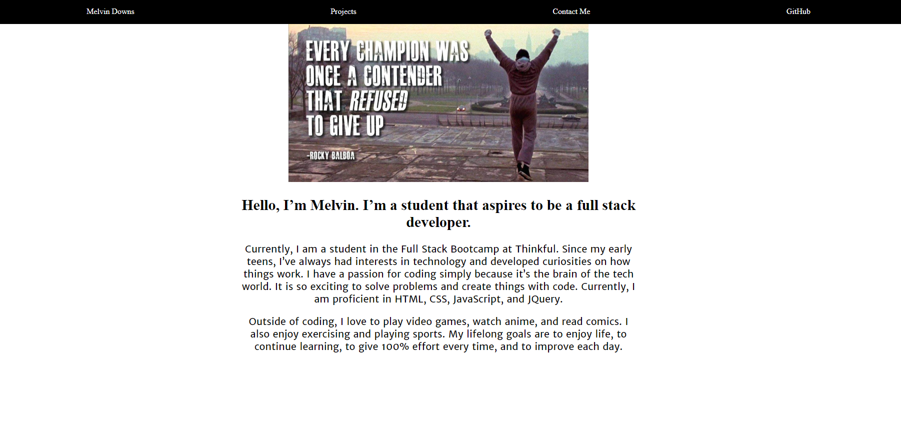
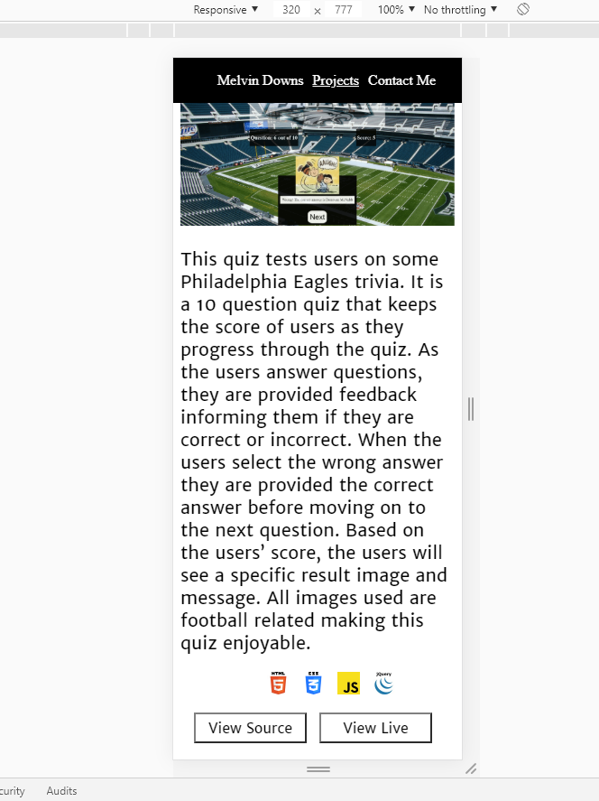

# MyPortfolio
This is my portfolio. Over time as I progress through my course at Thinkful, I will be updating it with projects I've completed.
As of now I only have the wireframe for my portfolio.
**UPDATE**
I added more CSS, javaScript, and Jquery to complete my portfolio. I decided to go with a simple design, and focused more on javascript and Jquery skills to make navigation through my portfolio user friendly. I designed with a mobile-first approach and styled for bigger screens afterwards. My goal is to continue adding on to my portfolio, as I progress through the course, with projects and by further enhancing my design as I develop my skills.

You can view the live page here: https://mdowns22.github.io/MyPortfolio/

